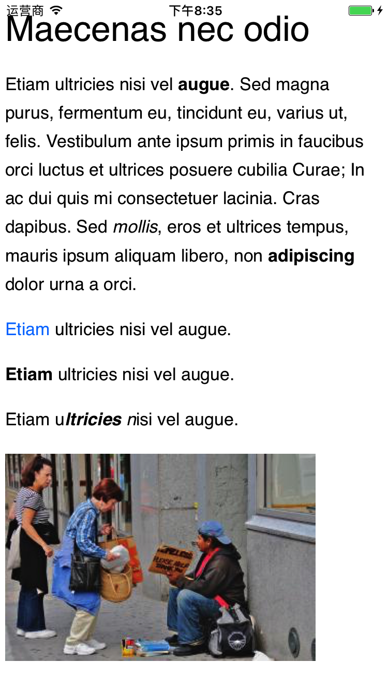

# JHDraftTextView

## In Brief 

a subclass of UITextView to parse Draft.js json to rich text

## Attributes Support

* Header (H1, H2, H3, H4, H5, H6)
* Ordered Item (1. 2. 3. ...)
* Unorder Item ( dot )
* Pictures with url (depends on SDWebImage)
* [Link](https://github.com/JiaHongXu)
* **Bold**, *Italic*, ***Bold+Italic***
* ~~Stroke Through~~
* Code Quote (e…doing)
* Block Quote (e…doing)

## Run

1. `pod update`
2. Double click `.xcworkspace`

## Draft

See [Draft.js](https://github.com/facebook/draft-js)

Also in project draft.json

