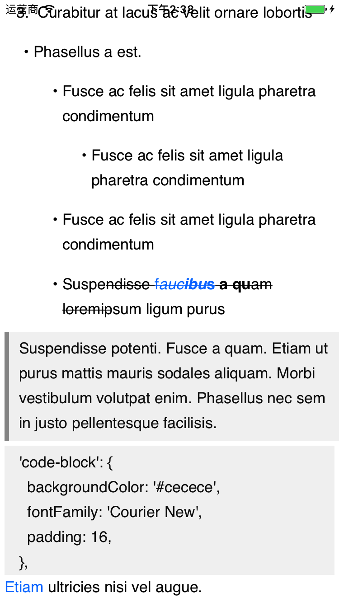

# JHDraftTextView

## In Brief 

a subclass of UITextView to parse Draft.js json to rich text

## Attributes Support

* Header (H1, H2, H3, H4, H5, H6)
* Ordered Item (1. 2. 3. ...)
* Unorder Item ( dot )
* Pictures with url (depends on SDWebImage)
* [Link](https://github.com/JiaHongXu)
* **Bold**, *Italic*, ***Bold+Italic***
* ~~Stroke Through~~
* Code Quote 
* Block Quote 

## Problems Remain

The method I applied to draw code quote & block quote may lead to display problems while changing the screens orientation

If you have better solution, mail me please. ^_^ at [xjh\_28@163.com](xjh\_28@163.com)

## Run

1. `pod update`
2. Double click `.xcworkspace`

## Draft

See [Draft.js](https://github.com/facebook/draft-js)

Also in project draft.json

